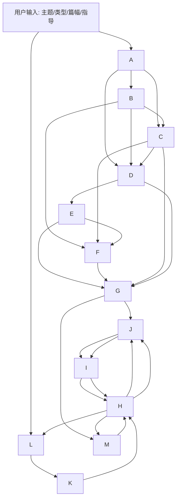

# Scout 4: 小说提示词 2 Pipeline 深扫报告

结论先行：这 13 个文件构成的是一条**小说创作流水线编排层**，不是能力本体。它把基座目录里的设定、框架、创作、检索、状态维护能力串起来，形成可执行 pipeline。这个判断成立。

## 13 阶段卡片

### 1. 阶段A 小说核心DNA生成专家
- 系统角色：把用户创作意图压缩成一句高张力故事公式。
- 输入契约：主题、类型、篇幅、章节数、每章字数。
- 输出契约：`STORY_DNA`，100字内的核心冲突公式。
- 思维链层数：5 层。
- 关键约束：必须包含主角驱动力、隐藏危机、灾难后果；不得平铺直叙。
- 公式/示例：`当[主角+身份]遭遇[核心事件]，必须[关键行动]，否则[灾难后果]；与此同时，[更大危机]正在发酵。`

### 2. 阶段B 角色动力学架构专家
- 系统角色：把故事核扩展成 3-6 人的冲突型角色群。
- 输入契约：`STORY_DNA`、用户指导。
- 输出契约：`CHARACTER_DYNAMICS`，含基础信息、隐藏要素、三级驱动力、关系网、成长弧线。
- 思维链层数：6 层。
- 关键约束：不能有工具人、完美人、单功能角色。
- 公式/示例：表面追求 / 深层渴望 / 灵魂需求三层驱动力。

### 3. 阶段C 三维世界构建专家
- 系统角色：构造能与角色决策互动的物理、社会、隐喻三维世界。
- 输入契约：`STORY_DNA`、`character_dynamics`、用户指导。
- 输出契约：`WORLD_BUILDING`，含物理维度、社会维度、隐喻维度。
- 思维链层数：5 层。
- 关键约束：世界必须服务冲突，不得装饰性堆设定。
- 公式/示例：空间结构 / 时间轴 / 法则体系。

### 4. 阶段D 三幕式情节架构师
- 系统角色：把角色冲突和世界矛盾整合成三幕结构。
- 输入契约：`STORY_DNA`、`character_dynamics`、`world_building`、用户指导。
- 输出契约：`PLOT_ARCHITECTURE`，含三幕、转折、伏笔、余波。
- 思维链层数：6 层。
- 关键约束：转折必须有因果，伏笔必须可回收。
- 公式/示例：第一幕触发、第二幕对抗、第三幕解决。

### 5. 阶段E 章节悬念节奏设计师
- 系统角色：把三幕大纲拆成可连载的章节节奏蓝图。
- 输入契约：`plot_architecture`、总章节数、用户指导。
- 输出契约：`CHAPTER_BLUEPRINT`，逐章标题、定位、悬念、伏笔、认知颠覆。
- 思维链层数：7 层。
- 关键约束：3-5 章一个悬念单元；前 `N-2` 章不能泄露终局。
- 公式/示例：2 章紧张 + 1 章缓冲的“认知过山车模式”。

### 6. 阶段F 角色状态档案
- 系统角色：建立长篇写作的角色状态底账。
- 输入契约：`character_dynamics`。
- 输出契约：`CHARACTER_STATE`，含物品、能力、身体/心理状态、关系网、事件。
- 思维链层数：6 层。
- 关键约束：必须可增量更新，不能静态冻结。
- 公式/示例：每个主要角色一张状态卡，外加新出场角色预留区。

### 7. 阶段G 首章内容创作专家
- 系统角色：把前期框架写成第一章正文。
- 输入契约：章节元信息、角色状态、世界观、情节架构、用户指导。
- 输出契约：首章纯正文，按字数控制。
- 思维链层数：6 层。
- 关键约束：首章要完成世界、角色、悬念、节奏四件事；不能信息堆砌。
- 公式/示例：至少 2 个动态张力场景，纯文学叙事，不用小标题。

### 8. 阶段H 后续章节创作专家
- 系统角色：基于既有摘要与知识库写续章。
- 输入契约：全局摘要、前章结尾、角色状态、当前章节摘要、下章预告、过滤后的知识库。
- 输出契约：后续章节正文。
- 思维链层数：6 层。
- 关键约束：70% 继承、30% 创新，不能与前文摘要冲突。
- 公式/示例：`前文基础 + 当前规划 + 下章预告 + 辅助资源 -> 正文`

### 9. 阶段I 全局摘要更新系统提示优化
- 系统角色：维护全书级时间线和长期摘要。
- 输入契约：新章节全文、当前全局摘要。
- 输出契约：`GLOBAL_SUMMARY_UPDATED`，不超过 2000 字。
- 思维链层数：5 层。
- 关键约束：客观记录，不做主观推测。
- 公式/示例：故事开端 / 情节发展 / 当前状态 / 伏笔与悬念 / 世界观发展。

### 10. 阶段J 当前章节摘要生成专家
- 系统角色：生成承上启下的单章摘要。
- 输入契约：前三章综合内容、当前章节元数据、下一章元数据。
- 输出契约：`CURRENT_CHAPTER_SUMMARY`，不超过 800 字。
- 思维链层数：6 层。
- 关键约束：必须标注冲突、延续要素、铺垫效果。
- 公式/示例：承继 → 发展 → 铺垫。

### 11. 阶段K 知识库内容过滤与重组专家
- 系统角色：把检索结果过滤成可写作的高质量素材包。
- 输入契约：检索文本、当前叙事需求。
- 输出契约：`FILTERED_CONTEXT`，按情节燃料/人物维度/世界碎片/叙事技法分类。
- 思维链层数：6 层。
- 关键约束：重复度高、冲突内容必须剔除或警示。
- 公式/示例：冲突检测 -> 价值评估 -> 结构重组。

### 12. 阶段L 知识库检索关键词生成专家
- 系统角色：为章节需求生成高命中检索词。
- 输入契约：章节元数据、当前创作需求。
- 输出契约：3-5 组优先级排序关键词。
- 思维链层数：5 层。
- 关键约束：不能过抽象，不能少于 3 组或多于 5 组。
- 公式/示例：实体+属性 / 事件+后果 / 概念+应用。

### 13. 阶段M 角色状态动态更新专家
- 系统角色：按章节增量更新角色状态底账。
- 输入契约：新章节全文、当前角色状态档案。
- 输出契约：`CHARACTER_STATE_UPDATED`，只改有变化的角色。
- 思维链层数：6 层。
- 关键约束：不得加入未出现的推测；不得删掉仍重要的历史状态。
- 公式/示例：物品、能力、状态、关系、事件五维增量更新。

## Pipeline DAG



### 依赖关系
- 串行主干：A -> B -> C -> D -> E -> G/H。
- 预写状态：F 依赖 B/C/E，先建立角色档案底账。
- 运行时循环：H -> J -> I -> M -> H。
- 检索支路：L -> K -> H，在章节写作前提供上下文素材。

### 可并行阶段
- A 之后，B/C 可强并行化；D 需要吃掉 B/C 的结果。
- E 与 F 可在 D 之后并行准备。
- L/K 可按章节循环独立运行，不阻塞主体写作。

## 状态机

### 状态实体

| 实体 | 关键字段 | 读写方式 | 备注 |
|---|---|---|---|
| `STORY_DNA` | topic, genre, chapter_count, core_conflict, hidden_crisis, limits | A 写入，后续只读 | 全局不可随意改写 |
| `CHARACTER_DYNAMICS` | roles, goals, arcs, relationship_graph | B 写入，D/G/H 读取 | 角色设计底稿 |
| `WORLD_BUILDING` | physical, social, metaphor, rules, loopholes | C 写入，D/G/H 读取 | 世界规则底层 |
| `PLOT_ARCHITECTURE` | acts, turning_points, foreshadows, twists | D 写入，E/G/H 读取 | 结构骨架 |
| `CHAPTER_BLUEPRINT` | chapter_no, function, suspense, hook, twist | E 写入，G/H 读取 | 逐章任务单 |
| `CHARACTER_STATE` | inventory, abilities, body, psyche, relations, events | F 初始化，M 增量更新 | 角色运行时状态 |
| `GLOBAL_SUMMARY` | timeline, active_conflicts, open_loops, world_changes | I 更新 | 长篇记忆压缩层 |
| `CURRENT_CHAPTER_SUMMARY` | inherit, progress, bridge, warnings | J 更新 | 单章承接层 |
| `FILTERED_CONTEXT` | fuel,人物,world_fragments,techniques, conflict_flags | K 更新 | 写作素材过滤层 |

### 流转规则
- `read`: G/H 读取 A-D/E/F/I/J/K/L/M 的受控子集。
- `write`: A/B/C/D/E/F 首次写入各自真值域。
- `update`: I/J/M 只写增量，不回写全文。
- `lock`: STORY_DNA、WORLD_BUILDING、PLOT_ARCHITECTURE 进入锁定态后只允许补丁式修订。

### 长篇一致性维护机制
1. A/B/C/D 形成“不可轻动”的创作常量，避免后面章节反向改设定。
2. F 保存角色运行时事实，M 每章只写差异，防止角色状态靠记忆硬撑。
3. J 压缩单章信息，I 再把单章摘要折叠进全局摘要，避免把整本书塞回上下文。
4. H 只读取“全局摘要 + 当前章节摘要 + 角色状态 + 本章素材”，而不是整本历史。
5. K/L 把外部知识压缩成章节可用素材，防止知识库直接污染正文。

## Workflow DSL 草案

```yaml
workflow:
  name: novel_pipeline_v1
  mode: serial_with_memory_loop
  canonical_state:
    locked: [STORY_DNA, WORLD_BUILDING, PLOT_ARCHITECTURE]
    mutable: [CHARACTER_STATE, GLOBAL_SUMMARY, CURRENT_CHAPTER_SUMMARY, FILTERED_CONTEXT]

  steps:
    - id: A
      type: generate_story_dna
      inputs: [topic, genre, chapter_count, word_count, user_guidance]
      outputs: [STORY_DNA]
      skip_if: "STORY_DNA exists and input_hash unchanged"
      on_error: {retry: 1, fallback: "ask_for_missing_brief"}

    - id: B
      type: build_character_dynamics
      inputs: [STORY_DNA, user_guidance]
      outputs: [CHARACTER_DYNAMICS]

    - id: C
      type: build_world
      inputs: [STORY_DNA, CHARACTER_DYNAMICS, user_guidance]
      outputs: [WORLD_BUILDING]

    - id: D
      type: build_three_act_plot
      inputs: [STORY_DNA, CHARACTER_DYNAMICS, WORLD_BUILDING, user_guidance]
      outputs: [PLOT_ARCHITECTURE]

    - id: E
      type: build_chapter_blueprint
      inputs: [PLOT_ARCHITECTURE, chapter_count, user_guidance]
      outputs: [CHAPTER_BLUEPRINT]
      skip_if: "chapter_count < 3"

    - id: F
      type: initialize_character_state
      inputs: [CHARACTER_DYNAMICS]
      outputs: [CHARACTER_STATE]

    - id: L
      type: generate_kb_keywords
      inputs: [chapter_metadata, creation_demand]
      outputs: [KNOWLEDGE_BASE_KEYWORDS]
      optional: true

    - id: K
      type: filter_kb_context
      inputs: [retrieved_texts, chapter_info]
      outputs: [FILTERED_CONTEXT]
      optional: true
      skip_if: "retrieved_texts empty"

    - id: G
      type: write_first_chapter
      inputs: [CHAPTER_BLUEPRINT, CHARACTER_STATE, WORLD_BUILDING, PLOT_ARCHITECTURE, user_guidance]
      outputs: [chapter_text]
      when: "chapter_no == 1"

    - id: H
      type: write_followup_chapter
      inputs: [GLOBAL_SUMMARY, previous_chapter_excerpt, CHARACTER_STATE, CURRENT_CHAPTER_SUMMARY, CHAPTER_BLUEPRINT, FILTERED_CONTEXT, user_guidance]
      outputs: [chapter_text]
      when: "chapter_no > 1"

    - id: J
      type: summarize_current_chapter
      inputs: [combined_text, current_chapter_info, next_chapter_info]
      outputs: [CURRENT_CHAPTER_SUMMARY]

    - id: I
      type: update_global_summary
      inputs: [chapter_text, GLOBAL_SUMMARY]
      outputs: [GLOBAL_SUMMARY]

    - id: M
      type: update_character_state
      inputs: [chapter_text, CHARACTER_STATE]
      outputs: [CHARACTER_STATE]

  transitions:
    - from: A
      to: [B, C, D]
    - from: D
      to: [E, F]
    - from: E
      to: [G, L]
    - from: G
      to: [J, I, M]
    - from: H
      to: [J, I, M]
    - from: J
      to: [I]
    - from: I
      to: [H]
    - from: M
      to: [H]
    - from: L
      to: [K]
    - from: K
      to: [H]

  error_handling:
    missing_input:
      action: "request_user_input"
    conflict_detected:
      action: "emit_conflict_flag and stop"
    summary_overflow:
      action: "compress and preserve unresolved_threads only"
    state_drift:
      action: "compare against CHARACTER_STATE and reopen diff"
```

## 与基座的垂直映射

### 结论
- **成立**：A~M 是流水线编排层，基座是能力库。前者决定顺序、契约和记忆策略，后者提供具体生成能力。
- **不是替代关系**：A~M 不替换基座，只是把基座模板按创作阶段串成系统。

### 映射关系
- A 对应基座的创意/设定入口，主要吃 `010-018` 的立项与卖点思路，以及 `020-022` 的核心设定起点。
- B 对应 `022/025/026/028/029` 一类角色设定模板，外加关系网络与对话潜台词类能力。
- C 对应 `021` 世界观构建主模板，并可向 `023` 等等级/力量体系模板扩展。
- D 对应 `020` 故事框架、`030-037` 大纲/细纲/章节纲等框架阶段能力。
- G/H 对应 `040-049` 创作阶段正文能力，以及 `050-060` 状态管理、悬疑伏笔、节奏校准、文风优化等进阶技巧。
- K/L 对应 `081-085` 辅助工具、`097` 素材收集、`119` 素材收集等检索与补料能力。

### 关键判断
- A~M 更像“小说操作系统的控制层”。
- 基座更像“可插拔的任务技能库”。
- 垂直关系是“调用”和“编排”，不是“覆盖”。

## 缺口分析

### 已覆盖
- 从故事核到角色、世界、三幕、章节、正文、摘要、状态回写，主链条是完整的。
- 有长篇写作最关键的记忆压缩机制，能支撑连载。

### 明显缺口
1. **立项与市场层缺失**：没有显式的题材选择、平台适配、读者画像、热度判断入口。
2. **终稿编辑层缺失**：没有专门的修订、语言润色、逻辑校验、敏感风险审查节点。
3. **发布与运营层缺失**：没有标题、简介、封面、章节发布节奏、读者运营、完结复盘。
4. **数据反馈闭环缺失**：没有把读者反馈、完读率、留存、评论情绪纳入主流程。
5. **版本治理缺失**：没有清晰的版本号、回滚、分支、差异对比机制。

### 结构性判断
- 这 13 阶段足够支撑“从开书到连载正文”的主流程。
- 若目标是“生产级小说系统”，还需要补一个**发布/反馈/复盘层**。

## 关键发现与建议

1. **F + I + J + M 是核心记忆层**：建议统一成一个共享状态 schema，避免四套摘要彼此打架。
2. **E 是全系统的控制中枢**：章节蓝图应该带版本号，因为它决定后续正文、摘要和状态回写的所有参照。
3. **K/L 应做成按需调用**：不是每章都强制检索，只有信息密度或场景细节不足时再启用。
4. **G/H 需要明确“输入最小集”**：正文生成只保留必要上下文，防止把完整历史灌进 prompt。
5. **建议补一条后处理流水线**：`正文 -> 润色/逻辑检查 -> 发布物料 -> 反馈复盘`，这样才算闭环。
